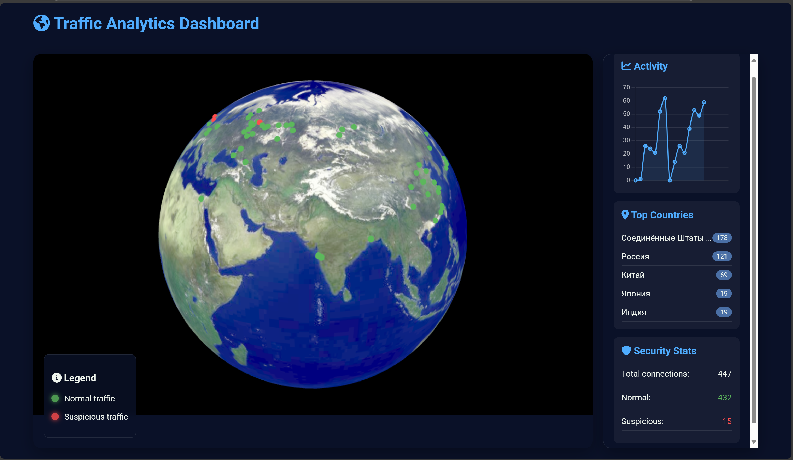

# Traffic Analytics Dashboard

The Traffic Analytics Dashboard is a project designed to visualize web traffic from various locations around the world. The primary goal is to strengthen knowledge in backend development using Python and Flask, as well as frontend development using Three.js for interactive and visually appealing visualizations.

## Features
- **Data Generation**: A Python script reads a CSV file containing traffic data and sends it to a Flask server.
- **Data Receiving**: The Flask server parses the received data and sends it to the frontend.
- **Interactive Visualization**: The frontend uses Three.js to display traffic locations on a globe.
- **Real-time Updates**: The dashboard updates in real-time, showing the most common locations and activity peaks.
- **Docker Deployment**: The entire system is containerized using Docker for easy deployment and reproducibility.

## Components

### Backend (Flask)
The Flask server receives traffic data from the sender script and serves it to the frontend. It includes endpoints for receiving data and serving static files.

### Frontend (Three.js)
The frontend uses Three.js to create an interactive globe that displays traffic locations. It includes a legend, activity chart, and a list of top countries.

### Data Sender (Python Script)
A Python script reads traffic data from a CSV file and sends it to the Flask server at specified intervals.

## How system looks while running



## Setup

### Prerequisites
- Docker
- Docker Compose

### Installation
1. Clone the repository:
   ```sh
   git clone https://github.com/Chehmet/WebTrafficVisualisation.git
   ```
2. Build and run the Docker containers:
   ```sh
   docker-compose up --build
   ```
      Alternatively, if you do not have Docker installed, you can run the Python scripts directly:
   ```sh
   python backend.py
   ```
   In a separate terminal, run:
   ```sh
   python sender.py
   ```
   
3. Open your browser and navigate to `http://localhost:5000` to view the dashboard.

For any questions or feedback, please contact [me in telegtam](https://t.me/Chehmet).
